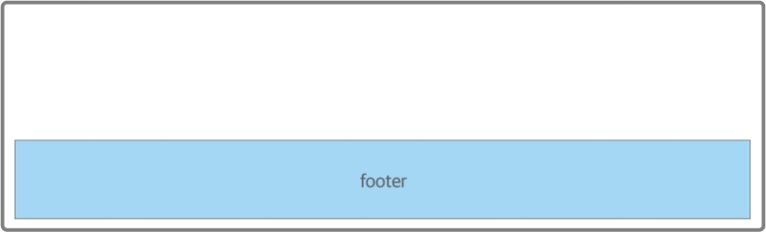

# LayOut3. Browser 화면 아래 붙는 Footer

- Web Page에서 footer는 보통 browser의 맨 아래에 위치
- 그래서 footer가 화면 아래에 딱 붙는 모습을 기대하지만, contents 길이가 화면보다 짧으면 footer는 contents가 짧아진만큼 위로 올라간 위치에 표시
- Flexbox를 사용하면 아래 그림과 같이 contents의 길이와 상관없이 항상 화면 아래에 표시되는 footer를 생성 가능

<br>

<div style="text-align : center;">
  
</div>

<br>

```css
/* footer를 구현하는 기본 CSS */
.flex-container {
  display: flex;
  flex-direction: column;
}

.flex-item {
  margin-top: auto;
}
```

<br>

---

<br>

## ◆ margin-top: auto 속성으로 자식 element를 화면 아래에 배치

- flex item에 "margin-top: auto" 속성을 적용하면 바깥 여백이 flex item을 위쪽에서 아래쪽으로 밀기 때문에 flex item이 아래쪽에 위치

<br>

<div style="text-align : center;">
  
</div>
